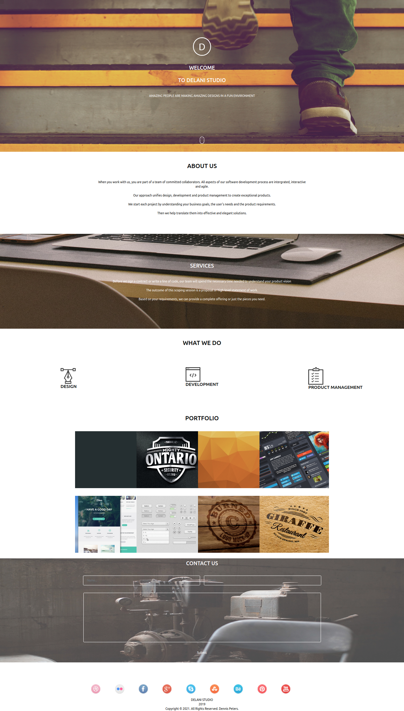

# DENNIS NJENGA THIRD IP SUBMISSION

### Project Name: DELANI STUDIO

### Project Description
An individual project for Delani Studio. The system is designed for a company that offers a wide range of services including brand strategy, interaction and visual design and user experience testing. 

### Setup Instructions
The operations of the project are fairly straighforward. 
The application makes use of bootstrap as well as a custom CSS file.
Google Chrome is highly recommend to run the program.

### BDD
Input includes a name, email and a message. On submit backened code runs evaluations to validate the output

### Author: [DENNIS NJENGA](https://github.com/deepeters)
### Contact Infomation:
         Email: dennis@dennis.com
         Phone: +254712345678

### Technology Used
1. HTML
2. CSS
3. Javascript

### LICENSE: [MIT LICENSE](https://raw.githubusercontent.com/deepeters/third-ip/master/LICENSE)
